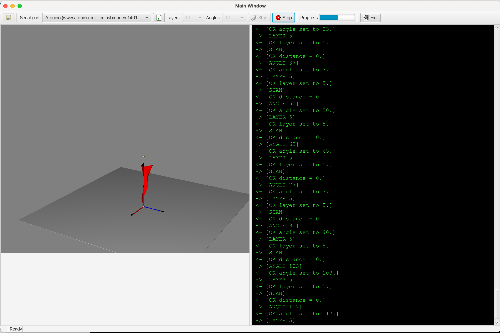
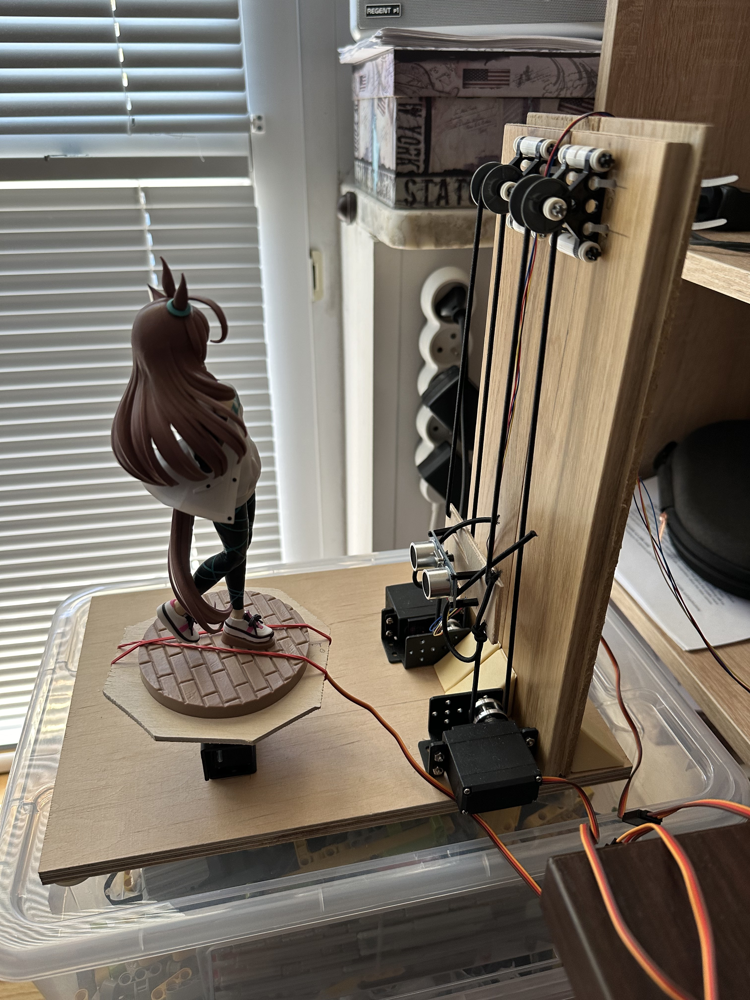
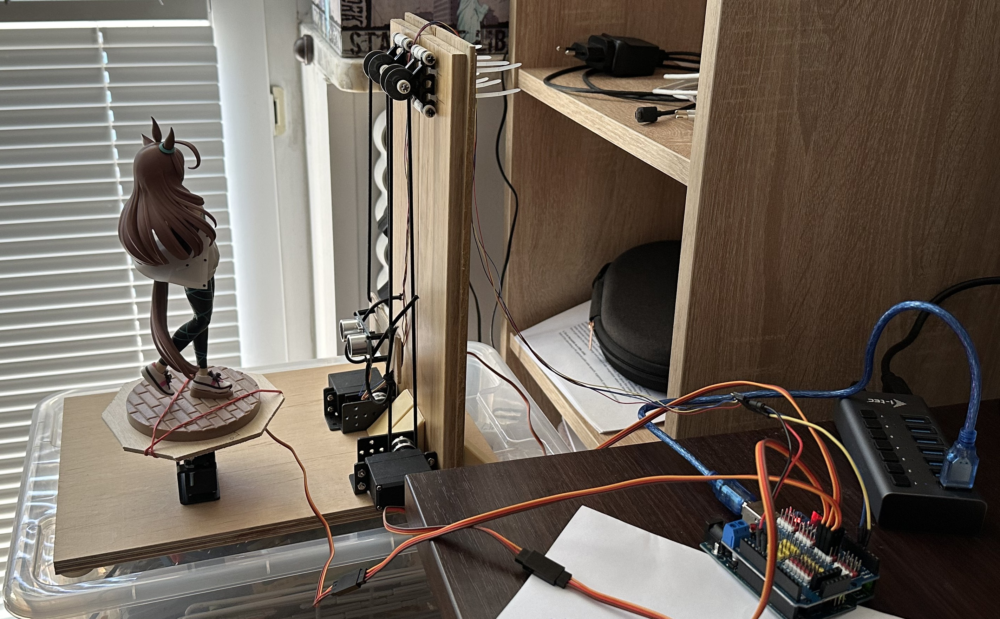

# An attempt to create PVC Figures scanner using Arduino and ultrasonic sensor

I created this project as a PoC to test if it is possible to create a PCV figures scanner using Arduino.
The ultrasonic sensor turned out to be a bad choice and the results where pretty bad.
I plan to switch to a laser class 1 sensor (eye safe that is) and try again.
Most of the work went not to the building of the hardware but to the software.

The application:


The hardware:



The hardware consists of ultrasonic sensor and 3 servos. Two of the servos where modded to a continuous operation (360 servos).
I made some parts out of LEGO bricks. Since this is PoC, the hardware is only so so, I plan to improve it when I find a suitable
working distance sensor.

The software was made using JavaFX framework.
How to build and run the app:
```
# Build the app
./mvnw clean install

# Run the app
./mvnw javafx:run -pl gui

# Run in the debug mode (waits for the debugger)
./mvnw javafx:run -pl gui -Pdebug
```

This app is using `jSerialComm` library for serial communication with Arduino.